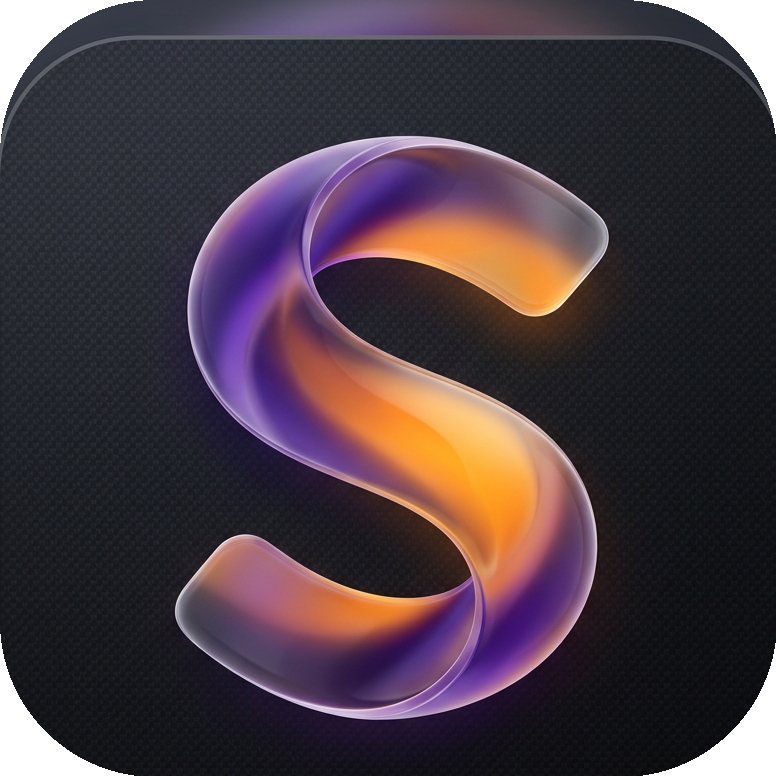

<p align="center">
  
</p>

<h1 align="center">Scribly</h1>

<p align="center">
  <em>A distraction-free, feature-rich desktop text editor built with Python & CustomTkinter</em>
</p>

<p align="center">
  <a href="https://www.python.org/"></a>
  <a href="https://github.com/tomschimanek/customtkinter"></a>
  <a href="https://pygments.org/"></a>
  <a href="https://github.com/SuryaK999/Scribly-Text-Editor-App"></a>
  <a href="https://opensource.org/licenses/MIT"></a>
</p>

---

Scribly resembles native modern OS editors (like **Linux Gedit** or **Windows Notepad**) while integrating professional developer utilities — real-time syntax highlighting, a visual custom theme builder, intelligent bracket matching, and a collapsible workspace sidebar.

---

## ✨ Features

<table>
  <tr>
    <td width="50%">

### 🎨 Unified Theme Engine
Blends toolbar, editor, and sidebar into one seamless canvas with 1-pixel separators. Ships with **6 built-in presets**:
- One Dark
- Monokai
- Cyberpunk
- Solarized Light / Dark
- Github Light

Plus a **visual Custom Theme Creator** (`+ Custom Theme` button) with real-time OS color picking — export directly as JSON.

</td>
    <td width="50%">

### ✍️ Syntax Highlighting
Real-time token-level styling powered by **Pygments**, debounced at 100ms for zero typing lag.

**Supported languages include:**
`Python` · `JavaScript` · `HTML` · `CSS` · `Markdown` · `JSON` · and many more auto-detected by file extension.

</td>
  </tr>
  <tr>
    <td>

### ⚡ Developer Conveniences
- **Auto-closing pairs** — `() {} [] "" ''`
- **Smart backspace** — deletes adjacent closing bracket
- **Bracket matching** — depth-scans & highlights matching pair under cursor
- **Auto-indentation** — matches previous indent, auto-indents after `:`

</td>
    <td>

### 🔍 Find & Replace
Slides in from the bottom with:
- Live match counter (`X of Y`)
- Case-sensitive toggle
- Whole-word matching
- **Regular expression** queries
- Bulk reverse-order **Replace All**

</td>
  </tr>
  <tr>
    <td>

### 📂 Workspace Explorer
Collapsible sidebar with a lazy-loading directory tree. Double-click any file to open it directly in the editor. Toggle with **Ctrl+B**.

</td>
    <td>

### 🔢 Smart Line Numbers
Column-synced sidebar that dynamically scales width, handles wrapped-line alignment, and highlights the active line number.

</td>
  </tr>
</table>

---

## 🛠️ Installation

### Prerequisites

- **Python 3.8** or higher — [Download Python](https://www.python.org/downloads/)

### Quick Start

```bash
# 1. Clone the repository
git clone https://github.com/SuryaK999/Scribly-Text-Editor-App.git
cd Scribly-Text-Editor-App

# 2. Create & activate virtual environment
python -m venv .venv

# Windows (PowerShell)
.venv\Scripts\Activate.ps1
# Windows (cmd)
.venv\Scripts\activate.bat
# macOS / Linux
source .venv/bin/activate

# 3. Install dependencies
pip install -r requirements.txt

# 4. Launch Scribly
python main.py
```

---

## 📦 Dependencies

| Package | Version | Purpose |
| :--- | :--- | :--- |
| [customtkinter](https://github.com/tomschimanek/customtkinter) | `≥ 5.2.0` | Modern, themeable GUI framework |
| [Pygments](https://pygments.org/) | `≥ 2.15.0` | Syntax highlighting engine |
| [darkdetect](https://github.com/albertosottile/darkdetect) | `≥ 0.8.0` | OS dark/light mode detection |
| [Pillow](https://python-pillow.org/) | `≥ 9.5.0` | Icon loading & multi-resolution scaling |

---

## ⌨️ Keyboard Shortcuts

| Shortcut | Action |
| :--- | :--- |
| `Ctrl + N` | New File |
| `Ctrl + O` | Open File |
| `Ctrl + S` | Save |
| `Ctrl + Shift + S` | Save As |
| `Ctrl + F` | Toggle Find & Replace |
| `Ctrl + B` | Toggle Workspace Sidebar |
| `Ctrl + Z` | Undo |
| `Ctrl + Y` | Redo |
| `Ctrl + X / C / V` | Cut / Copy / Paste |
| `Ctrl + +` / `Ctrl + -` | Zoom In / Out |
| `Ctrl + MouseWheel` | Dynamic Font Zoom |
| `Ctrl + W` / `Ctrl + Q` | Exit Application |

---

## 🗂️ Project Structure

```
Scribly-Text-Editor-App/
│
├── 📁 assets/
│   ├── icon.png             # High-resolution app icon (cross-platform)
│   ├── icon.ico             # Windows taskbar & title bar icon
│   └── icon.icns            # macOS bundle icon
│
├── 📁 components/
│   ├── editor_area.py       # Code editor widget, syntax highlighting, auto-pairs
│   ├── file_tree.py         # Lazy-loading workspace directory tree
│   ├── find_replace.py      # Slide-in find & replace panel
│   ├── line_numbers.py      # Scroll-synced line number sidebar
│   ├── status_bar.py        # Cursor position & document stats bar
│   └── theme_dialog.py      # Visual custom theme creator modal
│
├── main.py                  # Application entry point & layout manager
├── theme_manager.py         # Theme registry, loader & Pygments style mapping
├── requirements.txt         # Python package dependencies
├── .gitignore               # Git exclusion rules
└── README.md                # This file
```

---

## 🖥️ Menu System

Scribly provides a standard OS-native menu bar:

| Menu | Options |
| :--- | :--- |
| **File** | New File · Open File · Open Workspace Folder · Save · Save As · Exit |
| **Edit** | Undo · Redo · Cut · Copy · Paste · Find / Replace |
| **View** | Toggle Workspace Sidebar · Zoom In · Zoom Out |

---

## 🎯 Highlights

<div align="center">

| Feature | Details |
| :---: | :--- |
| 🪟 **Cross-Platform Icons** | Multi-resolution icons (16×16 → 256×256) for crisp rendering on all DPIs |
| 🧩 **Windows Taskbar Grouping** | Custom `AppUserModelID` for proper taskbar icon grouping |
| 💾 **Unsaved Changes Guard** | Prompts to save before closing, opening, or creating new files |
| 🔄 **Live Theme Switching** | Instantly swaps all UI layers — toolbar, editor, sidebar, menus, status bar |
| 📐 **Responsive Layout** | Min size 600×400, default 950×600 with resizable panels |

</div>

---

## 📄 License

This project is licensed under the **MIT License** — see the [LICENSE](LICENSE) file for details.

---

<p align="center">
  <sub>Built with ❤️ using Python & CustomTkinter</sub>
</p>
